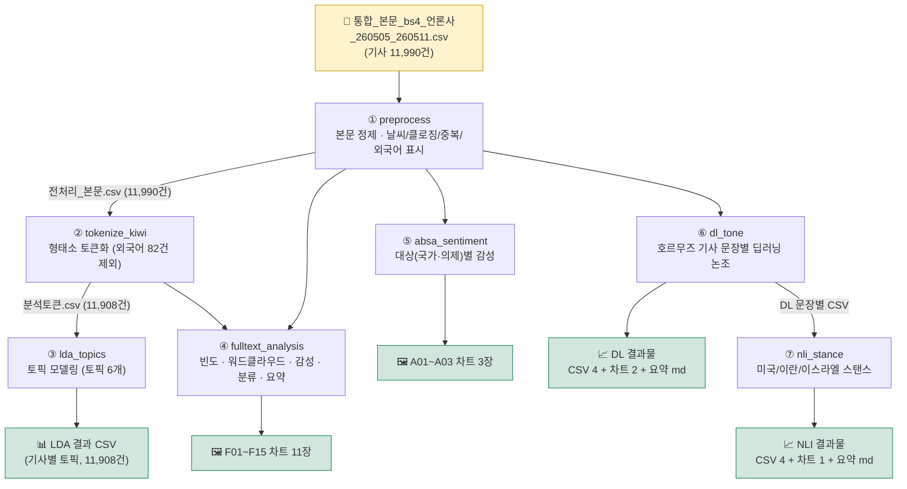

# 텍스트 데이터 분석 파이프라인

노트북 7개(전처리 → 토큰화 → LDA → 전체텍스트 분석 → ABSA 감성 → 딥러닝 논조 → NLI 스탠스)를 한 번에 실행할 수 있게 파이썬 파일로 정리함. 명령어 한 줄로 전 단계 순서대로 실행함.

```
[입력]  통합_본문_bs4_언론사_260505_260511.csv  (기사 11,990건)
   ↓   python pipeline_py/run_all.py
[출력]  분석 CSV 4개 + 차트 PNG 16개 + 요약 문서 2개
```

원본 노트북 결과와 맞는지 확인함. 딥러닝/NLI는 팀 공유 결과물 기준으로 비교함. **외국어로만 된 기사 82건(연합뉴스 영문·일문)은 분석 대상에서 제외**됨.

## 전체 진행 순서



`run_all.py`가 ①→⑦을 순서대로 실행함. 화살표는 앞 단계에서 만든 파일을 다음 단계가 다시 읽는 흐름을 뜻함.

---

## 요구 사항

| 항목 | 내용 |
|---|---|
| OS | Windows / macOS / Linux |
| Python | 3.11 |
| 입력 파일 | `통합_본문_bs4_언론사_260505_260511.csv` (약 29 MB) |
| 인터넷 | 최초 1회 필요 (패키지 및 딥러닝 모델 다운로드, 약 7 GB) |
| 디스크 여유 공간 | 10 GB 이상 |
| GPU | 선택 사항 (없어도 실행 가능, 있으면 딥러닝 단계가 빠름) |

---

## 설치 및 실행

### 1단계 — Python 3.11 환경 준비

Anaconda / Miniconda가 설치되어 있다면:

```bash
conda create -n news-analysis python=3.11 -y
conda activate news-analysis
```

없으면 https://www.anaconda.com/download 에서 설치 후 위 명령 실행.  
(`conda activate news-analysis`는 터미널을 새로 열 때마다 다시 입력 필요.)

### 2단계 — 저장소 클론

```bash
git clone https://github.com/ChaeYeonKim0204/Text-data-Analysis_26-Spring.git
cd Text-data-Analysis_26-Spring
```

git이 없으면 GitHub 페이지의 `Code` → `Download ZIP`으로 받아 압축을 풀고, 해당 폴더로 이동.

### 3단계 — 패키지 설치 (최초 1회, 5~15분)

```bash
pip install -r pipeline_py/requirements.txt
```

### 4단계 — 딥러닝 모델 다운로드 (최초 1회, 약 1.8 GB)

딥러닝 논조 분석(KR-FinBert-SC)과 NLI 스탠스 분석(roberta_with_kornli) 모델을 미리 받아 둠:

```bash
python -c "from transformers import AutoTokenizer,AutoModelForSequenceClassification as M; [ (AutoTokenizer.from_pretrained(x), M.from_pretrained(x)) for x in ('snunlp/KR-FinBert-SC','pongjin/roberta_with_kornli') ]"
```

완료 후 내 컴퓨터에 저장되므로 이후에는 인터넷 연결 없이도 실행 가능.

### 5단계 — 입력 데이터 배치

`통합_본문_bs4_언론사_260505_260511.csv`를 `data/news/` 폴더에 넣음:

```
Text-data-Analysis_26-Spring/
└── data/
    └── news/
        └── 통합_본문_bs4_언론사_260505_260511.csv
```

파일명을 변경하면 파이프라인이 파일을 찾지 못함.

### 6단계 — 실행

```bash
python pipeline_py/run_all.py
```

각 단계의 진행 상황이 화면에 출력됨. 마지막 줄에 아래가 출력되면 완료:

```
파이프라인 완료.
```

**소요 시간**: GPU 환경 약 30분, CPU 환경 1~2시간. GPU는 자동으로 감지됨.

---

## 결과 파일

| 위치 | 파일 | 내용 |
|---|---|---|
| `data/news/` | 전처리_본문_언론사_*.csv | 기사 본문 정제 + 표시 열 (11,990건) |
| `data/news/` | 분석토큰_언론사_*.csv | 형태소 분석 토큰 (11,908건) |
| `data/news/` | analysis_언론사_lda결과_재수집.csv | 기사별 LDA 토픽 배정 (토픽 6개) |
| `pipeline_py/산출물_차트/` | F01~F15.png (11장) | 전체텍스트 분석 차트 |
| `pipeline_py/산출물_차트/` | A01~A03.png (3장) | ABSA 감성 차트 |
| `pipeline_py/딥러닝_논조분석_산출물/` | CSV 4 + PNG 2 + 요약 md | 딥러닝 논조 분석 결과 |
| `pipeline_py/제로샷NLI_스탠스분석_산출물/` | CSV 4 + PNG 1 + 요약 md | NLI 스탠스 분석 결과 |

재실행 시 이전 결과물을 덮어씀.

---

## FAQ

**Q. `python: command not found` 또는 `conda: command not found`**  
→ 가상환경이 활성화되지 않은 상태임. `conda activate news-analysis` 실행.

**Q. `FileNotFoundError: 통합_본문...csv`**  
→ 5단계 확인. 파일이 `data/news/` 안에 정확한 파일명으로 있어야 함.

**Q. 모델 다운로드 중 실패**  
→ 인터넷 연결 확인 후 4단계 명령 다시 실행 (이미 받은 부분부터 이어받음).

**Q. 딥러닝 단계가 너무 느림**  
→ CPU 환경에서는 1시간 이상 걸릴 수 있음. GPU가 있는 환경에서 실행하면 빠름.

**Q. 차트 글자가 □□□로 깨짐**  
→ 분석 결과 수치에는 영향 없음. `resources/NanumGothic.ttf` 존재 여부 확인.

**Q. 중간에 오류로 종료됨**  
→ 오류 메시지 전체 확인.

---

## 추가 설명

<details>
<summary>펼치기</summary>

- **노트북 방식은 그대로 두고 실행 위치만 정리함**: 원본 노트북의 분석 방식은 그대로 두고, 실행 경로만 `config.py`에서 함께 관리함.
- **외국어 기사 제외**: `preprocess`에서 한글이 하나도 없는 기사를 `is_foreign`으로 표시하고, 토큰화 단계부터 분석에서 제외함. 이번 기간에서는 11,990건 중 82건이 제외되어 11,908건 분석.
- **확인한 내용**: `run_all.py`로 전체 단계가 끝까지 실행되는 것을 확인했고, 전처리·토큰화 결과도 원본 노트북 결과와 맞는지 비교함.
- **NLI 실행 설정**: `nli_stance.py`에서는 입력 오류가 나지 않게 해당 설정을 꺼 둠.
- **NLI 행 수 차이**: 팀 공유본은 국가별로 행을 나누기 전 결과이고, 현재 결과는 미국/이란/이스라엘별로 나눈 10,214쌍 결과임.
- **분석 기간**: 현재는 260505_260511 기간 기준으로 맞춰 둠. 다른 기간을 분석하려면 파일명과 기간 설정 변경 필요.
- **CPU 전용 PyTorch**: `pip install torch==2.12.0 --index-url https://download.pytorch.org/whl/cpu`

</details>
